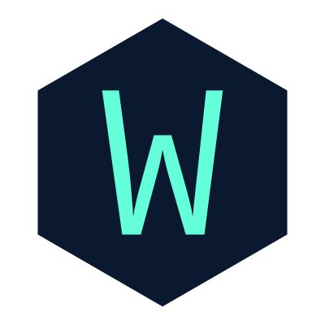

<div align="center">
  
</div>
<h1 align="center">
  wathmal.xyz - v4
</h1>
<p align="center">
  Personal portfolio of <a href="https://wathmal.xyz" target="_blank">Sasitha Sonnadara</a>, built with <a href="https://www.gatsbyjs.com/" target="_blank">Gatsby</a> and hosted on <a href="https://www.netlify.com/" target="_blank">Netlify</a>
</p>

## Installation & Set Up

1. Install the Gatsby CLI

   ```sh
   npm install -g gatsby-cli
   ```

2. Install and use the correct version of Node (Node 22) using [NVM](https://github.com/nvm-sh/nvm)

   ```sh
   nvm install
   ```

3. Install dependencies

   ```sh
   brew install vips # required on M-series Macs if libvips fails
   yarn
   ```

4. Start the development server

   ```sh
   npm start
   ```

## Building and Running for Production

1. Generate a full static production build

   ```sh
   npm run build
   ```

2. Preview the site as it will appear once deployed

   ```sh
   npm run serve
   ```

## Content

Work experience, featured projects, and other content live in the `content/` directory as Markdown files. To update a section, edit the corresponding `index.md` file:

- `content/jobs/` — Work experience ("Where I've Worked")
- `content/featured/` — Featured projects
- `content/projects/` — Other noteworthy projects

## Color Reference

| Color          | Hex                                                                 |
| -------------- | ------------------------------------------------------------------- |
| Navy           |  `#0a192f` |
| Light Navy     |  `#172a45` |
| Dark Grey      |  `#333f58` |
| Slate          |  `#8892b0` |
| Light Slate    |  `#a8b2d1` |
| Lightest Slate |  `#ccd6f6` |
| White          |  `#e6f1ff` |
| Green          |  `#64ffda` |

## Credit

This portfolio is based on the v4 design by [Brittany Chiang](https://brittanychiang.com). Original source at [bchiang7/v4](https://github.com/bchiang7/v4).
